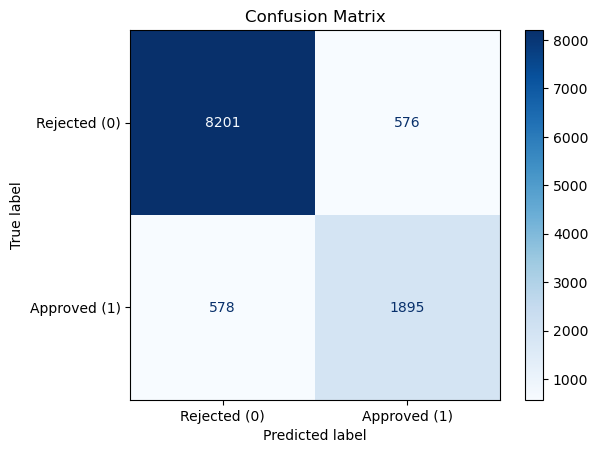
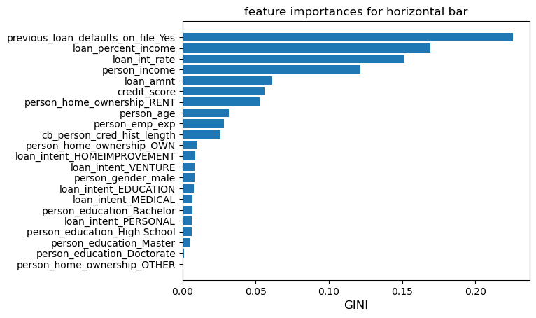
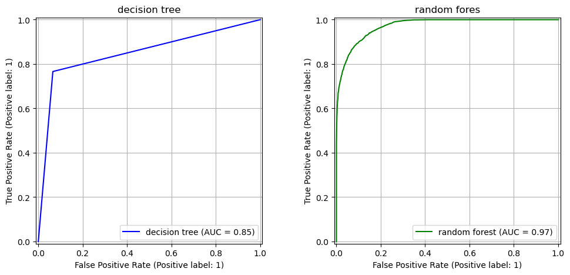
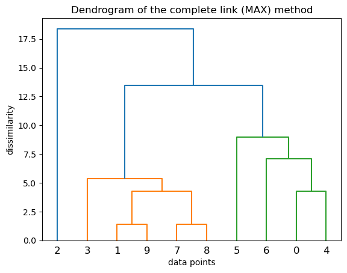
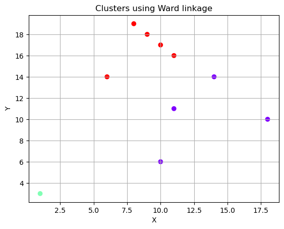
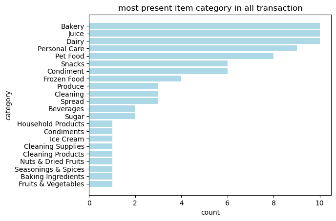
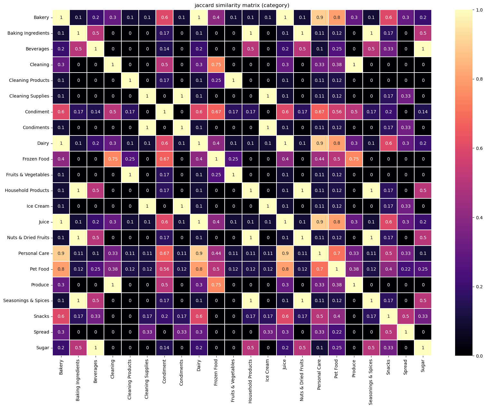

# 📊 Applied Data Mining & Machine Learning Analysis

Completed as part of the **STAT481: Fundamentals of Data Mining** course at the University of Bahrain.

This project applies supervised learning, unsupervised learning, and association rule mining techniques on real-world financial and retail datasets to uncover insights, evaluate predictive performance, and support data-driven decision-making.

---

# 👥 Team

- **Ebrahim Juma Alsawan**
- **Ali Sameer**

---

# 🎯 Project Overview

This project explores multiple real-world business problems using data mining and machine learning methodologies.

The analysis covers:

- Loan approval prediction using classification models
- Customer segmentation using clustering techniques
- Retail purchasing behavior using association rule mining

The project combines:
- Data preprocessing
- Exploratory data analysis
- Machine learning
- Statistical evaluation
- Data visualization
- Business insight generation

---

# 🧠 Techniques Covered

## Supervised Learning
- Decision Trees
- Random Forest
- Feature Importance Analysis
- Classification Evaluation Metrics

## Unsupervised Learning
- Hierarchical Clustering
- Agglomerative Clustering
- Dendrogram Analysis

## Association Rule Mining
- Apriori Algorithm
- Frequent Itemset Mining
- Association Rules
- Jaccard Similarity Analysis
- Correlation Analysis

---

# 🛠️ Tech Stack

```python
Python
Pandas
NumPy
Matplotlib
Scikit-learn
SciPy
Mlxtend
Jupyter Notebook
```

---

# 🔍 1. Loan Approval Classification

## 📌 Business Problem

Financial institutions require reliable methods to evaluate loan approval risk while minimizing default exposure.

This project applied supervised machine learning techniques to predict loan approval outcomes using demographic, financial, and credit-history features.

---

## 📖 Loan Dataset Data Dictionary

| Column | Type | Description |
|--------|------|-------------|
| `person_age` | int | Applicant age |
| `person_gender` | str | Applicant gender |
| `person_education` | str | Highest education level attained |
| `person_income` | float | Annual income of the applicant |
| `person_emp_exp` | int | Years of employment experience |
| `person_home_ownership` | str | Home ownership status |
| `loan_amnt` | float | Loan amount requested |
| `loan_intent` | str | Purpose of the loan |
| `loan_int_rate` | float | Loan interest rate |
| `loan_percent_income` | float | Loan amount as a percentage of income |
| `cb_person_cred_hist_length` | int | Length of credit history |
| `credit_score` | int | Applicant credit score |
| `previous_loan_defaults_on_file` | str | Indicates whether previous loan defaults exist |
| `loan_status` | int | Target variable indicating loan approval outcome |

---

## 🛠 Techniques Used

- Decision Trees
- Random Forest
- Feature Importance Analysis
- Confusion Matrix Evaluation
- ROC Curve Analysis
- Model Performance Metrics

---

## 📈 Results

- Accuracy: **92.56%**
- AUC Score: **0.97**

---

## 📌 Key Insights

- Credit score strongly influenced loan approval outcomes.
- Interest rate and income-to-loan ratio were major predictive features.
- Random Forest significantly improved prediction performance compared to baseline models.
- Previous loan default history negatively impacted approval probability.

---

## 📷 Project Visuals

<p align="center">
  
  
</p>

<p align="center">
  
</p>

---

# 📈 2. Hierarchical Clustering & Customer Segmentation

## 📌 Business Problem

Customer segmentation analysis was performed using hierarchical clustering techniques to identify behavioral customer groups and purchasing similarities.

The objective was to discover meaningful customer clusters that could support:
- targeted marketing
- customer profiling
- personalized recommendation strategies

---

## 🛠 Techniques Used

- Agglomerative Clustering
- Hierarchical Clustering
- Dendrogram Visualization
- Single Linkage
- Complete Linkage
- Ward Linkage

---

## 📌 Key Insights

- Different linkage methods produced significantly different cluster structures.
- Ward linkage generated the most balanced customer clusters.
- Hierarchical clustering effectively grouped similar customer behaviors.
- Cluster analysis highlighted clear segmentation opportunities for customer targeting.

---

## 📷 Project Visuals

<p align="center">
  
  
</p>

---

# 🛒 3. Market Basket Analysis

## 📌 Business Problem

Retail transaction data was analyzed using association rule mining techniques to uncover purchasing patterns and product relationships.

The analysis aimed to identify opportunities for:
- product bundling
- cross-selling
- shelf placement optimization
- category affinity analysis

---

## 📖 Transaction Dataset Data Dictionary

| Column | Type | Description |
|--------|------|-------------|
| `ID` | int | Unique transaction identifier |
| `Product` | str | Product purchased in the transaction |
| `Quantity` | int | Number of units purchased |
| `Price (BHD)` | float | Product price in Bahraini Dinar |
| `Category` | str | Product category classification |

---

## 🛠 Techniques Used

- Apriori Algorithm
- Association Rules
- Frequent Itemset Mining
- Jaccard Similarity Analysis
- Correlation Analysis

---

## 📌 Key Insights

- Bakery, Juice, and Dairy were the most frequently purchased categories.
- Strong similarity relationships were identified between multiple product categories.
- Association rule mining revealed opportunities for product bundling and optimized product placement.
- Product affinity analysis highlighted opportunities for cross-selling strategies.

---

## 📷 Project Visuals

<p align="center">
  
  
</p>

---

# 📊 Key Skills Demonstrated

- Machine Learning
- Data Mining
- Classification Modeling
- Clustering Analysis
- Association Rule Mining
- Exploratory Data Analysis (EDA)
- Feature Importance Analysis
- Data Visualization
- Statistical Evaluation
- Business Insight Generation

---

# 📁 Repository Structure

```bash
.
├── notebooks/
│   ├── loan_classification.ipynb
│   ├── clustering_analysis.ipynb
│   └── market_basket_analysis.ipynb
├── data/
├── images/
│   ├── confusion_matrix.png
│   ├── feature_importance.png
│   ├── roc_curve.png
│   ├── complete_link_dendrogram.png
│   ├── ward_linkage_clusters.png
│   ├── most_present_item_category.png
│   └── jaccard_similarity_matrix_category.png
└── README.md
```

---

# 🎓 Course Information

**Course:** STAT481 – Fundamentals of Data Mining  
**Institution:** University of Bahrain  
**Project Type:** Team Data Mining & Machine Learning Project

---

# 👤 Authors

### Ebrahim Juma Alsawan
- LinkedIn: https://www.linkedin.com/in/ebrahim-alsawan-a6977a2b9/

### Ali Sameer
- University of Bahrain
